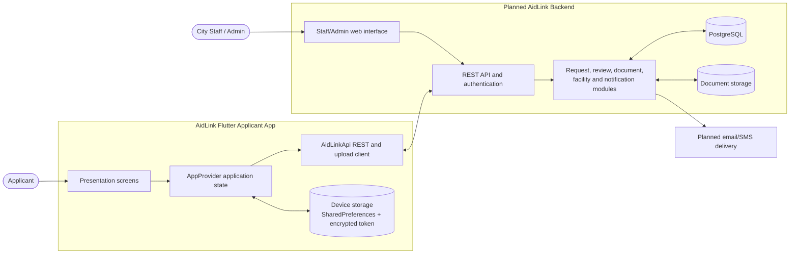
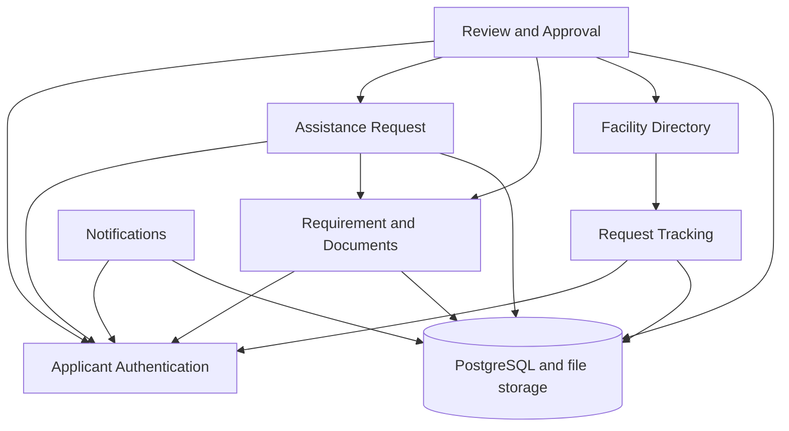

# AidLink Architecture Documentation

**Capstone Title:** AidLink: A Centralized Digital Assistance Management System for Davao City  
**Proponents:** Micko Jay Nino P. Llanos, Allyson M. Manulat, Justine M. Plenos  
**Instructor:** Ms. Christine Marie D. Ordaneza  
**Document Status:** Proposed architecture aligned with the implemented Flutter applicant application and planned backend

## 1. Architecture Overview

### Pattern: Layered Modular Monolith

AidLink is designed as a layered modular monolith with a Flutter client application, a centralized REST API, an administrative web interface, and a shared PostgreSQL database. The system is modular by business capability, but the backend is intended to be deployed and operated as one application during the capstone phase.

The Flutter application is a separate client of the API. Its presentation screens, application state, API client, local persistence, and device integrations are organized into clear layers. The backend and administrator functions are represented as planned components because they are not included in this Flutter repository yet.

### Why this pattern fits AidLink

- A centralized system is appropriate for a city assistance workflow managed by one organization.
- A modular monolith keeps deployment, authentication, database transactions, and maintenance manageable for a capstone project.
- Layered boundaries separate user interface concerns from request orchestration, domain rules, API communication, and persistence.
- Assistance requests require coordination between applicants, staff review, document validation, facilities, notifications, and approval artifacts. A single backend can manage these transactions consistently.
- The design leaves a practical path toward future modular services if request volume, document processing, or notifications eventually require independent scaling.

### Architectural scope

**Implemented in this repository:** Flutter applicant client, authentication screens, request form, assistance type selection, document selection/upload, dashboard, request history, request details, facility directory, notifications, profile, server settings, bearer-token handling, encrypted token storage, and local cached data.

**Planned system components:** REST backend, staff/admin interface, PostgreSQL schema, server-side authorization and review workflow, document storage, document analysis service, and outbound notification delivery.

## 2. High-Level System Components

These components are logical boundaries. They do not all represent separate deployable services.

| Component or layer | Responsibility | Current status and examples |
|---|---|---|
| Applicant Presentation Layer | Displays onboarding, sign-in, registration, dashboard, request forms, history, facilities, profile, settings, and notifications. Validates user input and manages navigation. | Implemented in Flutter under `lib/presentation`. |
| Applicant Application State Layer | Coordinates user actions, loading states, refresh, session transitions, cached data, and notification updates. Exposes state to widgets. | Implemented by `AppProvider` using Provider. |
| Client Data and Integration Layer | Defines API models, serializes JSON, sends REST requests, attaches bearer tokens, uploads files, resolves server URLs, and maps API errors. | Implemented by `AidLinkApi` under `lib/data/services`. |
| Local Device Persistence | Stores the configured API URL and non-sensitive cached profile/application data; stores the applicant bearer token in encrypted storage. | Implemented with SharedPreferences and Flutter Secure Storage. |
| REST API and Business Logic Layer | Authenticates applicants, validates requests, applies assistance rules, receives documents, coordinates review, updates statuses, and exposes applicant/admin endpoints. | Planned backend component. PostgreSQL is the planned database. |
| Staff/Admin Presentation Layer | Allows authorized staff to review submissions, validate requirements, assign facilities, approve or deny requests, issue remarks, and upload guarantee letters. | Planned component. |
| Document and File Storage | Stores applicant requirements and generated approval documents. Returns controlled URLs and metadata to authorized clients. | Planned server-side storage; the app already supports file upload/download contracts. |
| Notification Component | Creates and delivers status updates and other applicant notifications. | The app reads notifications and marks them read; delivery service is planned. |
| PostgreSQL Database | Stores applicants, requests, patients, assistance types, documents, review actions, facilities, notifications, and approval records. | Planned shared relational database. |

### Layering rule

The presentation layer calls application state methods. Application state calls the API/integration layer. The integration layer communicates with the backend and device storage. UI code must not directly construct HTTP requests or access database structures.

## 3. Functional Module Breakdown

| Module | Responsibility | Key inputs | Key outputs | Dependencies |
|---|---|---|---|---|
| Applicant Authentication and Identity | Registers applicants, signs them in, restores a session, stores the applicant identity, and handles expired credentials. | Name, email, phone, address, birth date, password, login credentials, bearer token | Applicant profile, applicant ID, authenticated session, signed-in state | REST API; encrypted device storage |
| Assistance Request | Collects patient details, relationship, address, sex, birth date, assistance type, and request metadata. | Applicant input, patient details, assistance type | Validated request payload, request reference number, initial status | Authentication; API; document module |
| Requirement and Document Management | Selects files, uploads requirements, requests document analysis, and displays document quality results. | Requirement type, selected file, document metadata | Uploaded document URL/metadata, analysis result, quality issues | Authentication; file picker; API; planned document storage/analysis |
| Request Tracking and History | Retrieves applicant-owned requests, sorts and filters them, displays progress, and opens request details. | Bearer token, request ID, status filters, search text | Request history, status timeline, request details, remarks | Authentication; REST API; PostgreSQL through backend |
| Review and Approval | Allows staff to inspect documents, update request status, record remarks, assign facilities, and issue approval artifacts. | Request, documents, review decision, facility, guarantee letter | Pending/under review/approved/denied status, remarks, QR data, guarantee letter | Staff authentication; request; document; facility modules |
| Facility Directory | Shows accredited providers assigned to active or approved requests and exposes contact/map actions. | Assigned facility data, facility search/filter | Facility cards, details, map link, phone action | Request tracking; backend facility records |
| Notification | Retrieves applicant notifications and records read state. | Applicant token, notification ID | Notification list, unread count, read confirmation | Authentication; backend notification component |
| Profile and Server Settings | Displays and updates local applicant context and allows the API server URL to be changed for development or deployment. | Profile data, server URL | Updated local settings and connection state | Local persistence; API client |

## 4. System Architecture Diagram

The following is the Level 1 system diagram. Solid arrows represent request/data direction. The dashed boundary indicates components planned for the complete system but not yet present in this Flutter repository.

## 5. Dependencies and Data Flow

### Dependency graph

### Core flow: submit an assistance request

1. The applicant signs in or registers. The API returns an applicant ID and bearer token. The app stores the profile locally and stores the token in encrypted device storage.
2. The applicant opens **New request** and enters patient identity, address, relationship, sex, and date of birth.
3. The applicant selects an assistance type and adds the required supporting documents.
4. The Flutter client sends each document to the backend through an authenticated upload request. The backend stores the file and returns document metadata. When enabled, the document analysis component returns acceptance, warnings, or quality issues.
5. The application state layer assembles the patient details, assistance type, and uploaded document references. It sends the completed request to the REST API.
6. The backend validates that the applicant owns the session, validates the request and required documents, writes the request and related records in PostgreSQL, and returns a reference number and initial status such as `pending`.
7. The app displays the submission result and caches a local representation of the submitted application. The applicant can later refresh the authenticated request list or open a specific request.
8. Staff review the request through the admin interface. They may update the status, add remarks, assign an accredited facility, and attach approval artifacts.
9. The applicant receives the updated status through request refresh and notifications. For an approved request, the app can display the QR code and download or print the guarantee letter.

### Data ownership and access rules

- The backend is the source of truth for request status, review decisions, facilities, notifications, QR data, and guarantee-letter metadata.
- The applicant may read only requests associated with the authenticated bearer token.
- The app must not use an applicant ID or email supplied by the client as a substitute for server-side identity derivation.
- The shared database is accessed by backend repositories or data-access services, not directly by Flutter screens or independent modules.
- Local storage improves continuity and offline presentation, but it must not be treated as proof of approval or as the authoritative request record.

### Key risks and mitigation

| Risk | Description | Mitigation |
|---|---|---|
| Unimplemented backend boundary | The Flutter client depends on API behavior and response shapes that must still be implemented and versioned. | Define an API contract, use integration tests, validate response schemas, and keep the API client isolated behind `AidLinkApi`. |
| Unauthorized request access | A user could attempt to request another applicant's records by changing a request ID. | Derive applicant identity from the verified bearer token and enforce ownership checks on every request endpoint. |
| Sensitive documents and personal data | Assistance requests contain identity, health-related, and financial-support information. | Use HTTPS in deployment, encrypted token storage, role-based access, least-privilege repositories, access logging, and controlled file URLs. |
| Shared database coupling | A schema change can affect request tracking, review, notifications, and facility views. | Use repositories and DTOs, document ownership of tables, version migrations, and avoid cross-module direct table access. |
| Upload and document failure | Large or invalid files can interrupt submission or create incomplete requests. | Validate file type and size, analyze before final submission, use clear retryable errors, and keep request/document states explicit. |
| External notification failure | Email or SMS delivery may fail after a request status changes. | Treat delivery as retryable and separate from the core database transaction; retain notification status and delivery attempts. |
| Single backend failure | The centralized backend is a single operational dependency. | Add structured logging, health checks, database backups, retries for safe external calls, and clear degraded/offline states in the app. |
| Deployment coupling | A backend change affects the complete system deployment. | Keep modules internally independent, use API versioning and feature flags, and consider extracting high-load modules later. |

## 6. Design Principles Applied

### High cohesion

Each module owns one recognizable business capability. Authentication owns identity and sessions; request management owns submission data; document management owns files and analysis; review owns staff decisions; and tracking owns applicant-facing status views.

### Low coupling

Modules communicate through application methods, API contracts, model objects, and DTO-like response models. Flutter widgets do not know the database schema, and the planned backend modules should not query another module's tables directly.

### Separation of concerns

The Flutter presentation layer renders screens, `AppProvider` coordinates application state, `AidLinkApi` handles transport and serialization, and local storage handles persistence. The planned backend separates HTTP delivery, business rules, repositories, and external file/notification integrations.

### Single source of truth

The backend owns authoritative request and review state. Local caches support usability and offline continuity but are cleared or refreshed when the authenticated server session changes.

### Security by boundary

Authentication is represented by a bearer token, tokens are stored using encrypted device storage, and authenticated API calls attach the token. Server-side authorization remains mandatory for every applicant and staff operation.

### Scalability and evolvability

The modular monolith can scale vertically and can add caching, background document analysis, or queued notifications without changing the applicant UI contract. If future usage justifies it, document processing and notification delivery are the clearest candidates for independent services.

### Maintainability and testability

The API client and `AppProvider` can be tested independently of widgets. Backend modules can be tested through service and repository tests, while API contract tests verify that the Flutter models continue to match server responses.

## 7. Conclusion

The proposed layered modular-monolith architecture gives AidLink a manageable capstone implementation while preserving clear boundaries for future growth. The Flutter app already demonstrates the presentation, state, integration, and device-persistence portions of the design. The planned REST backend, PostgreSQL database, and staff/admin interface complete the system needed to securely receive, review, approve, and track Davao City assistance requests.

The next implementation milestone is to freeze the REST API contract and PostgreSQL data model for authentication, request submission, document uploads, review status, facilities, notifications, QR approval proof, and guarantee-letter retrieval.